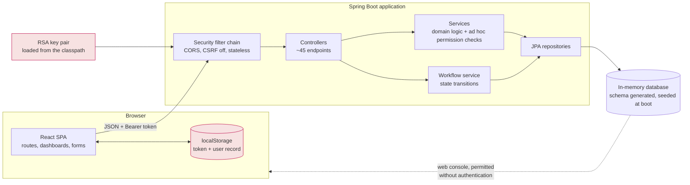
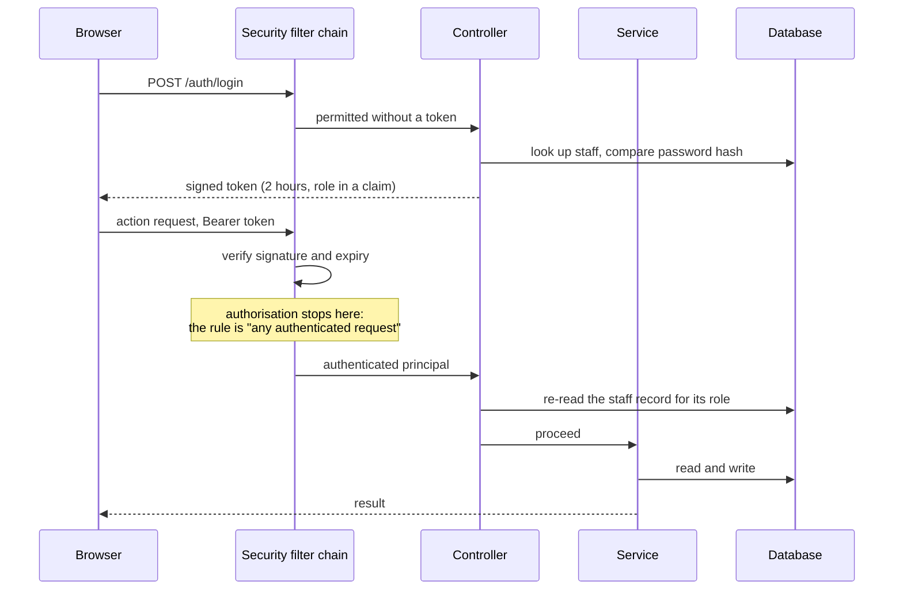

# 2. Architecture as built

What the implementation is, from reading it. No source is reproduced; the
diagrams are mine.

## Shape

Two deployables: a Spring Boot backend exposing a JSON API, and a React
single-page application that calls it. An in-memory relational database,
created and seeded at start-up.

The two boxes in red are where the design leaks; both are covered in
[the security review](05-security-review.md).

## Backend layering

The intended layering is conventional and mostly followed:

**Controller → Service → Repository → Database**, with data transfer objects
at the boundary and JPA entities inside.

Two things break it, and both matter:

1. **Business logic in controllers.** The status-change endpoints for two of
   the three assessment kinds contain the entire state machine inline — a
   switch over status strings, with permission checks interleaved. Those are
   the longest methods in the codebase, and they are in the layer that has no
   tests.

2. **A second, disagreeing workflow implementation.** A dedicated workflow
   service also exists, with its own state constants and its own transition
   tables. It is a cleaner design than the controller code. The two never
   agree, and both are reachable from the API. See
   [roles and workflow](03-roles-and-workflow.md).

## Scale

Counted from the source tree:

| | |
|---|---|
| Backend Java files (main) | 49 |
| HTTP endpoints | 45 |
| Method-level authorisation annotations | **0** |
| Frontend components and pages | 17 |
| Backend test methods | 15 |
| Frontend test methods | 1 (the unmodified project template) |

Method security is switched **on** at the configuration level, and then never
used: not one endpoint or service method carries an authorisation annotation.
Every permission decision that exists is written by hand inside a method body.
That combination — the mechanism enabled, the mechanism unused — is what makes
the missing checks hard to see by inspection.

## Request path

Two observations about that path.

**The token's role claim is not what is checked.** The role travels in the
token, but every permission decision re-reads the staff record from the
database. That is accidentally the safer choice — a role change takes effect
immediately rather than at the next login — but it is not a decision the code
appears to have made deliberately, since nothing consults the claim at all.

**The filter chain's only rule is "authenticated".** Beyond that, whether an
endpoint checks anything depends entirely on whether its author wrote a check.
Some did. Many did not.

## Frontend

React with client-side routing. A context object holds the token, the user
record, and derived role flags; every protected route is wrapped in a guard
that checks **only that a token exists**. Role-based dispatch happens one
level lower, inside the dashboard component, which chooses a view by role.

The consequence is architectural rather than incidental: **the frontend's role
logic is presentation, not enforcement.** It decides what to render. Since the
backend's authorisation is patchy, in several flows the rendering decision is
the only thing standing between a user and an action.

Five components — including a sign-up form and a guest-only route wrapper —
are present in the source tree but imported by nothing. They are unfinished
work rather than dead code, and one of them corresponds to
[the most serious finding](05-security-review.md#f1-anyone-can-create-an-account-and-choose-its-role) in
the review: the sign-up endpoint is fully implemented on the server and simply
never wired into the interface.
