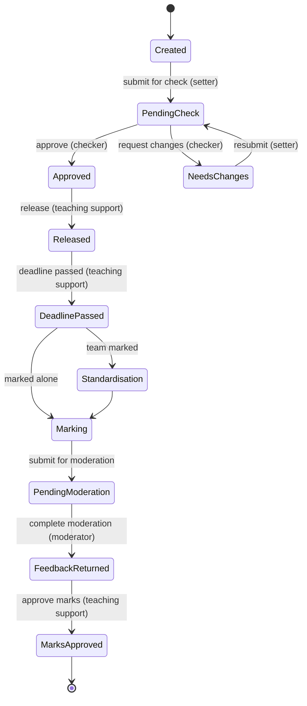
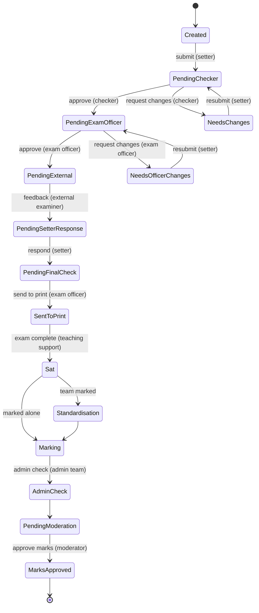
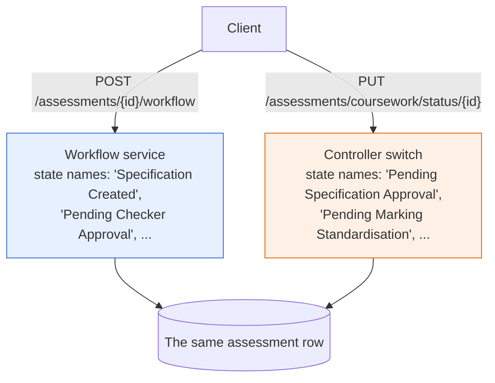

# 3. Roles, permissions and the assessment workflow

## Two kinds of authority

The implementation distinguishes them in practice while storing them the same
way, and that mismatch is the root of several findings.

**Standing roles** are properties of a staff member: teaching support, exam
officer, admin team, external examiner, academic.

**Per-assessment relationships** are properties of a *pairing*: the setter of
this coursework, the checker of this paper, the moderator of this module, the
exam officer of record for this exam.

Most of the interesting permissions are relationships. "Approve this
specification" is not something a checker may do; it is something *this
assessment's checker* may do. The implementation gets this right in the places
where it checks anything at all — it compares the caller's username against
the assessment's checker — which shows the model was understood.

## How roles are stored, and why it matters

A staff record holds its roles in **a single text field**, and permission
checks ask whether that text *contains* a role name. Nineteen such checks
appear across the backend.

Three consequences follow directly:

- **Substring collisions.** A check for `ACADEMIC` also matches
  `EXTERNAL_ACADEMIC`. No such role exists today, so this is latent rather
  than live — but it means every future role name is a potential silent
  privilege change, decided by string containment rather than by anyone.
- **No validation.** Nothing constrains the field to known role names. A role
  string that matches nothing simply grants nothing, silently.
- **A second, competing notion of the same thing.** Exam officer status exists
  *twice*: once as a substring of the role field, and once as a boolean column
  on the staff record. Different code paths consult different ones. The
  promotion endpoint sets the boolean; a service-layer check reads the string.
  A staff member can be an exam officer according to one check and not
  according to the other.

## The workflow, as the dedicated service defines it

The workflow service holds a coherent state machine. This is my drawing of the
coursework path it defines:

And the exam path, which is where the separation of duties is really visible:

Four different people are required to move an exam from draft to print. The
domain model is sound, and it was clearly thought about.

## The defect: two workflows, one system

There is a second implementation of the same workflow, inline in the
controllers, for coursework, exams and tests.

It is not a refactoring in progress. It is a **different state machine**, with
a **different vocabulary of state names**, reachable through **different
endpoints**, on the **same records**.

The two vocabularies do not overlap. An assessment advanced through one path
lands in a state the other path's switch has no case for — where it falls
through to a generic "there was an error changing the status" and stops. The
record is not corrupt; it is simply **stuck**, reachable only by the half of
the system that put it there.

This is the finding I would lead with in a code review, ahead of the security
issues, because it is the one that will produce support tickets nobody can
explain. And it is a *process* failure rather than a coding one: two people
solved the same problem in parallel and neither deletion happened.

## The authorisation asymmetry

Within the cleaner workflow service, two methods matter:

- One computes **which actions are available** to a given user, consulting
  both the user's role and their relationship to the assessment. It is
  careful, and its logic matches the diagrams above.
- The other **performs a transition**. It takes an assessment id and an
  action name. It does not take a user. It performs no authorisation of any
  kind.

The controller exposing the second one passes the authenticated principal in —
and never uses it.

So the careful role logic is computing **what to render**, and the endpoint
that changes the state enforces nothing beyond "you are logged in". Any
authenticated staff member can drive any assessment through any legal
transition: approve a paper they are not the checker of, submit an external
examiner's feedback, send an exam to print.

The controller-inline workflow does check permissions — but it reads the
assessment's status, checker and moderator **from the request body**, so the
caller supplies the facts the permission check is based on. Both paths fail;
they fail differently.

Getting the model right and enforcing it in the wrong layer is a specific,
recognisable mistake, and it is what
[the redesign in this repository](../src/assessment_policy/) is built to make
structurally impossible.
