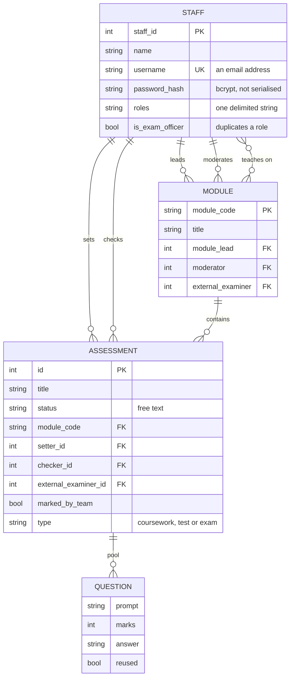

# 4. The data model

Reconstructed from the entity classes and their mappings. Attribute names are
mine; the structure is what the implementation defines.

Coursework, tests and exams are subtypes of one assessment table, discriminated
by a type column. Coursework adds a specification and a submission date; tests
add an autograded flag; exams add external examiner feedback, a setter
response, and an exam officer.

## What is right

**Passwords are hashed with bcrypt and excluded from serialisation.** Both, and
in a codebase where other basics are missing, that is worth saying plainly.
The password never reaches the API even when the whole staff record is
returned. This was done properly.

**Relationships are modelled as relationships.** Setter, checker, moderator and
external examiner are foreign keys to staff, not strings. The domain model
understood that "who may approve this" is per assessment, and the schema
supports asking that question. The failure in the implementation is that the
question is often not asked — not that it could not be.

**The question pool is embedded in its assessment.** Questions have no
independent lifecycle, so that is the right call.

## What is not

**Status is free text.** Nothing constrains it to a known set. This is what
made two disagreeing state machines *possible*: if status were an enumerated
type, the second vocabulary would not have compiled. A schema-level constraint
would have turned a silent data problem into a build failure.

**Exam officer exists twice.** A boolean column and a substring of the role
field, written by different code paths and read by different checks. There is
no constraint keeping them consistent, and no single answer to "is this person
an exam officer".

**Roles are a delimited string.** Not a table, not an enumerated set. Unindexed
and unvalidated, and queried by substring.

**No history.** The assessment row holds only its current status. There is no
record of who moved it, from what, or when. For a system whose entire purpose
is a chain of approvals, this is the most consequential omission in the schema:
after the fact, there is no way to answer the question the workflow exists to
answer. Every transition is exactly the event you would want in an audit log,
and none is kept.

**A subtype-specific column is misspelled.** The coursework specification
column carries a typo in its name. It works, because the schema is generated
from the same declaration that reads it, and it would matter the moment
anything else touched the database.

**Deleting staff reassigns their work to a placeholder.** A deleted staff
member's assessments are pointed at an invented "deleted user" account. The
intent — do not lose the assessment — is right. The record is silently
rewritten rather than marked, so the history of who set a paper is destroyed
by the deletion of an account. With an audit log, this would not have needed
to be destructive at all. The reassignment also depends on persistence
happening implicitly at the end of the transaction: a local flag is set to
track that a change occurred and then never used, which reads like a save
that was intended and then dropped.

## The schema I would write instead

The changes are small and each one closes a specific finding above:

- `status` becomes an **enumerated type**, one vocabulary, with the
  transition table the only thing allowed to change it.
- `roles` becomes a **join table** to a role enumeration. `is_exam_officer`
  disappears into it.
- An **assessment_event** table: assessment, from-status, to-status, action,
  actor, timestamp. Append-only. The current status becomes derived — or
  cached with the event log as the source of truth.
- Staff deletion becomes **deactivation**: a flag, not a row removal, so the
  assessment keeps pointing at the person who really set it.

The event log is the one I would insist on. It closes the audit gap, it makes
deletion non-destructive, and it turns the state machine into something you can
verify after the fact rather than only reason about.
