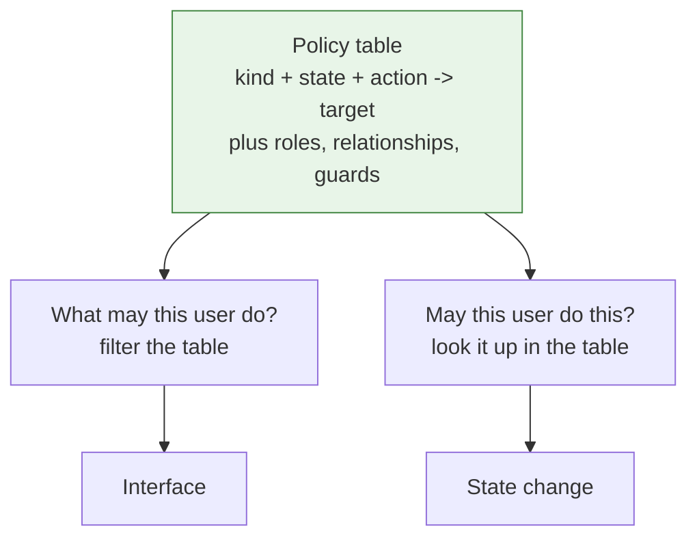

# 6. What I would build instead

The findings are not ten independent bugs. They are one design decision made
early — **authorisation is something each endpoint remembers to do** — and
nine consequences.

So the change is not "add the missing checks". It is to make the missing check
impossible to write.

## The idea

**One table describes every legal transition and who may perform it. Every
question the system asks about the workflow is answered from that table.**

Not "the same rules". The same table, at runtime.



The interface and the enforcement cannot disagree, because there is nothing
for them to disagree about. That single change closes F2 (the endpoint that
checks nothing) and F5 (the endpoints nobody wrote a check for), because there
is no per-endpoint place to forget.

It is implemented in [`src/assessment_policy/`](../src/assessment_policy/) and
the property is asserted in
[`tests/test_no_drift.py`](../tests/test_no_drift.py) over every combination of
kind, state, actor and action — 672 tests in total.

## The five decisions

### 1. The actor is a parameter, not a convention

`perform(assessment_id, actor, action)`. There is no overload without an
actor, so an endpoint cannot forget to pass one; it would not compile.

*Closes F2.*

### 2. Nothing about the assessment comes from the caller

The engine takes an identifier and reads the record from the store. There is
no parameter through which a state, a checker or a moderator could be
supplied, so a permission check cannot be evaluated against attacker-supplied
facts.

*Closes F3.*

### 3. Roles are a set of enumerated values; relationships are separate

`Actor` holds a `frozenset[Role]` and rejects anything that is not a member of
the enumeration. Relationships are derived from the assessment record. A
transition names roles, relationships, or both.

```python
Actor(1, ["exam_officer"])   # TypeError: not a Role
```

*Closes F9.*

### 4. A transition with no principals is a test failure

```python
def test_no_transition_is_open_to_everyone():
    unguarded = [t for t in POLICY if not t.roles and not t.relationships]
    assert unguarded == []
```

The missing authorisation the audited system had is not a thing you have to
notice in review here. It is a red test.

*Closes F5, structurally.*

### 5. Permission and precondition are different refusals

"You are not the checker" and "the deadline has not passed" are different
problems with different fixes, so they are different exceptions.

Guards are named and carry an explanation, which lets the interface show a
disabled action *with its reason* instead of hiding it — a button that
vanishes is indistinguishable from a permission you do not have.

It also makes the deadline comparison a one-line function with a test either
side of it, which is what the audited system got backwards.

## What the tests assert

Not "each transition works". Properties of the table as a whole — the level at
which "some endpoint has no authorisation" is visible at all:

| Property | Why |
|---|---|
| No transition is open to everyone | The F2/F5 class, made unrepresentable |
| Offered actions are exactly the actions that succeed | The F2 drift, for every state and actor |
| A refused action never changes the state | No partial application on refusal |
| Every state is reachable; exactly one is terminal | No stranded state, no dead end |
| Every state and action in the vocabulary is used | The unused half of a second vocabulary cannot survive |
| No `(state, action)` pair is defined twice | Ambiguity is a load-time error |
| A role does not grant a per-assessment permission | Being *an* exam officer is not being *this paper's* |

The second row is the one worth reading. It runs `available_actions` and then
tries every action through `perform`, for every kind, state, actor and action,
and asserts the two sets are equal. On the audited system, that test would fail
for every state where the interface hid an action the API still allowed.

## What this deliberately is not

- **Not a rewrite of the application.** No web layer, no database, no
  frontend. The engine is the part the findings are about.
- **Not a general workflow library.** It models this domain. Configurable
  workflow engines are their own trap.
- **Not a full authorisation system.** Authentication, session lifetime, token
  storage and key management (F1, F4, F6, F7, F8, F10) are argued for in the
  review and not implemented here.

## What I would do beyond it

- **An append-only event log** as the source of truth for state, with the
  current status derived. Closes the audit gap in
  [the data model](04-data-model.md) and makes staff deletion non-destructive.
- **A test that enumerates the HTTP endpoints** and asserts every one carries
  an explicit authorisation rule. That single test is the cheapest thing in
  this document and it catches the largest finding.
- **Development-only profiles** for the seeded accounts and the database
  console, so neither can be built into a deployed artifact.
- **Key material from the environment**, with a documented command to generate
  a development pair so a clean clone starts.

## The lesson I actually take from this

The team understood the domain. The relationships are modelled correctly, the
state machines are right, and the permission checks that exist compare the
right things. The failure was not knowledge.

It was that **authorisation was structured as a thing to remember**, and six
people under a deadline, each writing a few endpoints, remembered it in
different places and not in others. Every finding in the review is downstream
of that.

What I want from this is not "check authorisation on endpoints". It is: when a
control matters, find the shape that makes forgetting it a failure — a
required parameter, a table with no way to express an empty rule, a test over
the whole surface rather than each case. Discipline does not survive a
deadline. Structure does.
